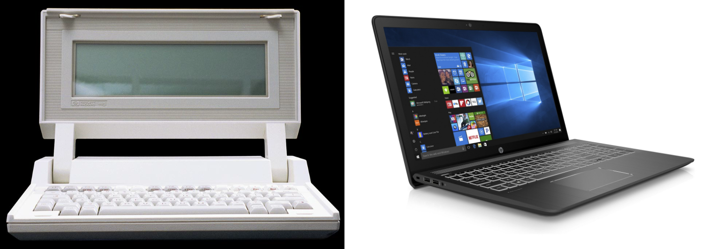

# The HP-110 and Pavilion Power 15
___

[^1]
___

| *Specs* | *HP-110* | *Pavilion Power 15* | *Difference* |
| :-----: | :------: | :-----------------: | :----------: |
| CPU | Harris 80C86 | Intel i7-7700 | ~4 Decades |
| Frequency | 5.33 MHz | 2.8-3.8 KHz | 525-712% Faster |
| Graphics | Integrated | GTX 1050 | like way better |
| RAM | 272 KB | 16 GB | 59000% Larger |
| Storage | 384 KB ROM | 1TB HDD | 2.6M% Larger & Writeable |
| Screen | 480x128 LCD | 1920x1080 WLED | 34% More Pixels & Colored | 
| Weight | 3.36 Kg | 2.21 Kg | 35% Lighter | 
| Price | $2995(1985) $8510(2023) | $1000(2017) $1250(2023) | 85% Cheaper |

[^1]: [HP Virtual Museum](https://www.hp.com/hpinfo/abouthp/histnfacts/museum/personalsystems/0036/0036sixviews.html), [Notebookcheck](https://www.notebookcheck.net/HP-Pavilion-Power-15-cb061nd.245640.0.html)
